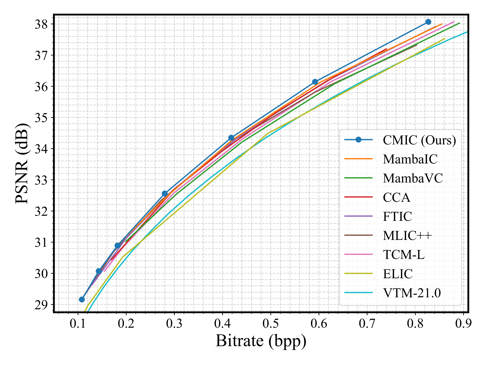
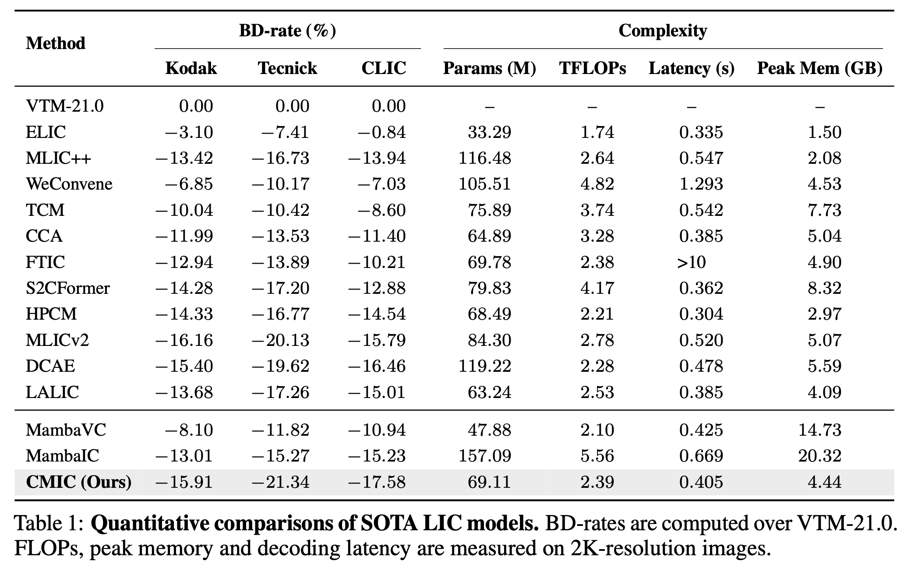

# ICLR2026-Content-Aware Mamba for Learned Image Compression

## News 🔥
Our paper "Adaptive Learned Image Compression with Graph Neural Networks" has been accepted to CVPR 2026. Code and checkpoints are released at [GLIC](https://github.com/UnoC-727/GLIC).


## Introduction

This repository is the offical [Pytorch](https://pytorch.org/) implementation of [Content-Aware Mamba for Learned Image Compression (ICLR2026)](https://openreview.net/forum?id=WwDNiisZQm). 

**Abstract:**
Recent learned image compression (LIC) leverages Mamba-style state-space models (SSMs) for global receptive fields with linear complexity. However, the standard Mamba adopts content-agnostic, predefined raster (or multi-directional) scans under strict causality. This rigidity hinders its ability to effectively eliminate redundancy between tokens that are content-correlated but spatially distant. We introduce Content-Aware Mamba (CAM), an SSM that dynamically adapts its processing to the image content. Specifically, CAM overcomes prior limitations with two novel mechanisms. First, it replaces the rigid scan with a content-adaptive token permutation strategy to prioritize interactions between content-similar tokens regardless of their location. Second, it overcomes the sequential dependency by injecting sample-specific global priors into the state-space model, which effectively mitigates the strict causality without multi-directional scans. These innovations enable CAM to better capture global redundancy while preserving computational efficiency. Our Content-Aware Mamba-based LIC model (CMIC) achieves state-of-the-art rate-distortion performance, surpassing VTM-21.0 by 15.91%, 21.34%, and 17.58% in BD-rate on the Kodak, Tecnick, and CLIC datasets, respectively.


## Environment
```
python -m pip install causal-conv1d --no-build-isolation
python -m pip install mamba-ssm --no-build-isolation
```

## Architectures

The overall framework of CMIC.


## RD Results

<!-- RD curves on Kodak.

 -->


Quantitative comparisons.



## Testing

``` 
python test_cmic.py   --checkpoint 0.05checkpoint_best.pth.tar 0.025checkpoint_best.pth.tar 0.013checkpoint_best.pth.tar  --image_dir xx/kodak

# --checkpoint: one or more checkpoint paths
```


## Pretrained Model

This repository provides the implementation and checkpoints of the accelerated version CMIC_AuxT, which is trained with the acceleration strategy of [AuxT](https://github.com/qingshi9974/auxt).

**This is an initial release, and more updates will follow.**


| Lambda | Metric | BaiduNetdisk                                                 | GoogleDrive                                                  |
| ------ | ------ | ------------------------------------------------------------ | ------------------------------------------------------------ |
| 0.05   | MSE    | [BaiduNetdisk (code: t8es)](https://pan.baidu.com/s/182bqgy8D-Af5QzkyEAKxRg?pwd=t8es) | [GoogleDrive](https://drive.google.com/file/d/1gIU2EPNXw8GeZKDWUJvRoMDBQKirfXY7/view?usp=share_link) |
| 0.025  | MSE    | [BaiduNetdisk (code: esq6)](https://pan.baidu.com/s/1eHWtpI1cDsJNkRgrEy_AsQ?pwd=esq6) | [GoogleDrive](https://drive.google.com/file/d/14W8Fh4LH2lr7nxlv4S62kfJ9wCcNxWgE/view?usp=share_link) |
| 0.013  | MSE    | [BaiduNetdisk (code: d8rb)](https://pan.baidu.com/s/15KiHKJDqYBhu7YwYMi933w?pwd=d8rb) | [GoogleDrive](https://drive.google.com/file/d/1QVYTl5V9W5gwIfhYIryNAkOPVL7ZcA5Z/view?usp=share_link) |
| 0.0067 | MSE    | [BaiduNetdisk (code: sqkd)](https://pan.baidu.com/s/1HjkVibT2Xmdk8NlSSaQeYw?pwd=sqkd) | [GoogleDrive](https://drive.google.com/file/d/1F0CfDHWjBqRiADmWtFU6wECaMual8liq/view?usp=share_link) |
| 0.0035 | MSE    | [BaiduNetdisk (code: 6j8n)](https://pan.baidu.com/s/1e2RpEV7_dOgPEcOl4TGk7g?pwd=6j8n) | [GoogleDrive](https://drive.google.com/file/d/1hX1Ww9Bzo6HTXiRbYq5P_gRPiIYRVyEm/view?usp=share_link) |
| 0.0025 | MSE    | [BaiduNetdisk (code: tqzx)](https://pan.baidu.com/s/1JIRj8y_it-6p7lepMtBdvw?pwd=tqzx) | [GoogleDrive](https://drive.google.com/file/d/1NZJDb5-jya2gQ5G1UFUPgKTpsL3fxs9i/view?usp=share_link) |
| 0.0017 | MSE    | [BaiduNetdisk (code: 9257)](https://pan.baidu.com/s/1r_Cm8S5GuL72mR41rNVG3w?pwd=9257) | [GoogleDrive](https://drive.google.com/file/d/1Mz4y8nZoRcS6EbtjT8nkGeF_SSW6QNH4/view?usp=share_link) |


## R-D data

### Kodak,PSNR

``` 
bpp = [0.826, 0.591, 0.417, 0.281, 0.182, 0.143, 0.108]
psnr = [38.10, 36.17, 34.37, 32.58, 30.91, 30.09, 29.18]
```


### CLIC,PSNR
```
cmic_bpp = [0.6075, 0.4244, 0.2976, 0.2032, 0.1346, 0.1071, 0.0819]
cmic_psnr = [38.8409, 37.2129, 35.7078, 34.1995, 32.7262, 31.9787, 31.1331]
```


### Tecnick,PSNR
```
cmic_bpp = [0.5562, 0.3923, 0.2804, 0.1970, 0.1367, 0.1125, 0.0895]
cmic_psnr = [38.8640, 37.3359, 35.9004, 34.4364, 32.9854, 32.2373, 31.3769]
```


## Acknowledgement

This implementation builds upon several excellent projects:

- [FTIC](https://github.com/qingshi9974/ICLR2024-FTIC)
- [AuxT](https://github.com/qingshi9974/auxt)
- [MambaIRv2](https://github.com/csguoh/MambaIR)
- [CompressAI](https://github.com/InterDigitalInc/CompressAI)
- [Neosr](https://github.com/neosr-project/neosr/tree/31c7022620c682cf0961c8634d60787179145c5b)


## Related Publications

* **Knowledge Distillation for Learned Image Compression**  
  ***Yunuo Chen***, Zezheng Lyu, Bing He, Ning Cao, Gang Chen, Guo Lu, Wenjun Zhang  
  *ICCV 2025* | [📄 Paper](https://openaccess.thecvf.com/content/ICCV2025/papers/Chen_Knowledge_Distillation_for_Learned_Image_Compression_ICCV_2025_paper.pdf)


* **S2CFormer: Revisiting the RD-Latency Trade-off in Transformer-based Learned Image Compression**  
  ***Yunuo Chen***, Qian Li, Bing He, Donghui Feng, Ronghua Wu, Qi Wang, Li Song, Guo Lu, Wenjun Zhang  
  *arXiv, 2025* | [📄 Paper](https://arxiv.org/pdf/2502.00700) | [💻 Unofficial Code](https://github.com/tokkiwa/S2CFormer)
  

## Contact

Feel free to reach me at [cyril-chenyn@sjtu.edu.cn](cyril-chenyn@sjtu.edu.cn) if you have any question.


## Citation

```
@inproceedings{
chen2026contentaware,
title={Content-Aware Mamba for Learned Image Compression},
author={Yunuo Chen and Zezheng Lyu and Bing He and Hongwei Hu and Qi Wang and Yuan Tian and Li Song and Wenjun Zhang and Guo Lu},
booktitle={The Fourteenth International Conference on Learning Representations},
year={2026},
url={https://openreview.net/forum?id=WwDNiisZQm}
}
```


